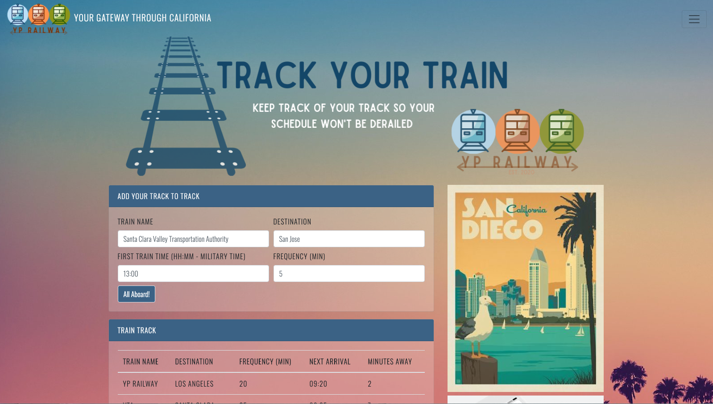

# traintime

## Project Description
Never lose track of your track! With this train scheduler created with Firebase (to host arrival and departure data), Javascript, CSS and HTML, you will be able to input any train, time and frequency and the scheduler will output when your train will arrive next and also how many minutes away it is.

### See it in Action!
Track your train here: <a href = "https://ypangilinan.github.io/traintime/">https://ypangilinan.github.io/traintime/</a>

### How was this app created?
The technologies used to create this app are:
- JavaScript
- jQuery
- Firebase
- Moment.js
- HTML
- Bootstrap

### Assignment Requirements
* Make sure that your app suits this basic spec:
  
  * When adding trains, administrators should be able to submit the following:
    
    * Train Name
    
    * Destination 
    
    * First Train Time -- in military time
    
    * Frequency -- in minutes
  
  * Code this app to calculate when the next train will arrive; this should be relative to the current time.
  
  * Users from many different machines must be able to view same train times.
  
  * Styling and theme are completely up to you. Get Creative!

